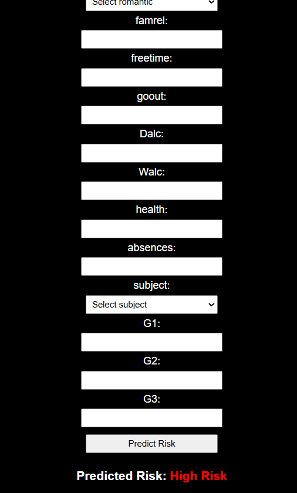

# 🎓 AI-Powered Student Academic Risk Prediction

<p align="center">


</p>

<h1 align="center">
🎓 AI-Powered Student Academic Risk Prediction System
</h1>

<p align="center">

An end-to-end Machine Learning web application that predicts students' academic risk using demographic, academic, and behavioral features.

Built with ❤️ using FastAPI, Scikit-learn, Pandas, NumPy, and Jinja2.

</p>

---

# 📑 Table of Contents

- Overview
- Problem Statement
- Project Objectives
- Key Features
- Dataset
- Exploratory Data Analysis
- Data Preprocessing
- Feature Engineering
- Machine Learning Pipeline
- Model Training
- Model Evaluation
- Deployment
- Technology Stack
- Project Structure
- Installation
- Running the Project
- Screenshots
- Results
- Future Improvements
- Author
- License

---

# 📖 Overview

Educational institutions often struggle to identify students who are at risk of poor academic performance before it becomes too late. Early identification enables educators to provide timely interventions, improve student engagement, and reduce failure rates.

This project presents an AI-powered academic risk prediction system that leverages machine learning algorithms to classify students into different academic risk categories based on demographic, educational, and behavioral information.

The system includes a complete machine learning pipeline—from data preprocessing and feature engineering to model training, evaluation, and deployment using FastAPI.

---

# 🎯 Problem Statement

Traditional academic monitoring relies heavily on manual evaluation and historical observations, making it difficult to detect struggling students early.

This project aims to automate the prediction process by utilizing machine learning techniques to identify students who may require additional academic support.

---

# 🎯 Project Objectives

- Predict student academic risk accurately.
- Compare multiple machine learning algorithms.
- Build an end-to-end prediction pipeline.
- Deploy the trained model using FastAPI.
- Provide a simple and interactive web interface.
- Demonstrate practical machine learning deployment.

---

# ✨ Key Features

✅ Exploratory Data Analysis (EDA)

✅ Data Cleaning & Preprocessing

✅ Feature Engineering

✅ Multiple Machine Learning Models

✅ Random Forest Classifier

✅ FastAPI Deployment

✅ Interactive HTML Interface

✅ Risk Prediction

✅ User-Friendly Input Form

✅ Production-ready Machine Learning Pipeline

---

# 📊 Dataset

The dataset contains demographic, academic, and behavioral information describing each student.

Examples of included attributes:

- School
- Gender
- Age
- Address Type
- Family Size
- Parent Education
- Parent Occupation
- Study Time
- Travel Time
- Previous Failures
- Internet Access
- Family Relationship
- Health Status
- Free Time
- Alcohol Consumption
- Attendance
- Grades (G1, G2, G3)
- Subject

The target variable represents the student's academic risk category.

---

# 📈 Exploratory Data Analysis (EDA)

Before building the prediction model, a comprehensive Exploratory Data Analysis (EDA) was conducted to better understand the dataset and identify potential issues.

The analysis included:

- Dataset overview
- Missing value detection
- Duplicate records inspection
- Statistical summary
- Distribution analysis
- Categorical feature analysis
- Correlation analysis
- Outlier detection

### EDA Goals

- Understand feature distributions
- Identify noisy data
- Detect missing values
- Improve data quality
- Support better feature engineering

---

# 🧹 Data Preprocessing

Raw educational data cannot be used directly for machine learning.

Several preprocessing techniques were applied to prepare the dataset.

### Preprocessing Pipeline

```text
Raw Dataset
      │
      ▼
Missing Value Handling
      │
      ▼
Data Cleaning
      │
      ▼
Feature Encoding
      │
      ▼
Feature Scaling
      │
      ▼
Processed Dataset
```

### Techniques Used

| Step | Method |
|------|--------|
| Missing Values | Checked and cleaned |
| Duplicate Records | Removed |
| Categorical Features | One-Hot Encoding |
| Numerical Features | Standard Scaling |
| Feature Alignment | Reindexing |

---

# 🧠 Feature Engineering

Feature Engineering played an important role in improving model performance.

New meaningful features were generated from the original dataset to capture hidden academic patterns.

Examples include:

- Attendance-related indicators
- Academic performance indicators
- Behavioral combinations
- Grade aggregation
- Educational characteristics

These engineered features helped the model better distinguish between different academic risk levels.

---

# 🤖 Machine Learning Models

Multiple supervised machine learning algorithms were trained and evaluated.

| Algorithm | Purpose |
|------------|---------|
| Logistic Regression | Baseline Linear Classifier |
| Decision Tree | Rule-Based Classification |
| Random Forest | Ensemble Learning |
| Support Vector Machine | Margin-Based Classification |
| Neural Network | Deep Learning Classification |

Rather than relying on a single algorithm, multiple approaches were compared to identify the most effective model.

---

# 📊 Model Comparison

Several evaluation metrics were used during experimentation.

| Metric | Description |
|---------|-------------|
| Accuracy | Overall prediction correctness |
| Precision | Correct positive predictions |
| Recall | Ability to detect positive cases |
| F1 Score | Balance between Precision and Recall |
| Classification Report | Detailed performance analysis |

The comparison demonstrated that ensemble learning achieved the most stable and accurate results.

---

# 🌲 Selected Model — Random Forest

After evaluating all candidate algorithms, the **Random Forest Classifier** was selected as the final deployment model.

### Why Random Forest?

- High predictive accuracy
- Strong generalization ability
- Resistant to overfitting
- Handles mixed feature types
- Robust against noisy educational data

The trained model was serialized using **Joblib** and integrated into the FastAPI application.

---

# 📉 Prediction Classes

The deployed model predicts one of the following categories:

| Prediction | Meaning |
|------------|---------|
| 🟢 Low Risk | Student is academically stable |
| 🟡 Medium Risk | Student may require monitoring |
| 🔴 High Risk | Student requires immediate academic intervention |

---

# ⚙ Machine Learning Pipeline

```text
Student Dataset
        │
        ▼
Exploratory Data Analysis
        │
        ▼
Data Cleaning
        │
        ▼
Feature Engineering
        │
        ▼
Encoding
        │
        ▼
Scaling
        │
        ▼
Train/Test Split
        │
        ▼
Model Training
        │
        ▼
Model Evaluation
        │
        ▼
Random Forest Selection
        │
        ▼
Model Serialization
        │
        ▼
FastAPI Deployment
```

---

# 💾 Model Serialization

The trained machine learning artifacts were saved using **Joblib** for efficient deployment.

Saved components include:

- Random Forest Model
- Feature Columns
- Scaler
- Dropdown Values
- Numeric Limits

These files are loaded automatically when the FastAPI server starts, enabling real-time predictions without retraining the model.

# 🌐 System Architecture

The application follows a simple and scalable architecture that separates machine learning, backend logic, and presentation layer.

```text
                    User
                      │
                      ▼
              HTML Web Interface
                      │
                      ▼
                FastAPI Backend
                      │
          ┌───────────┴───────────┐
          ▼                       ▼
   Data Validation         Feature Processing
          │                       │
          └───────────┬───────────┘
                      ▼
               Random Forest Model
                      │
                      ▼
             Academic Risk Prediction
                      │
                      ▼
             Prediction Result (UI)
```

---

# 🏗 Project Structure

```text
Student-Academic-Risk-Prediction
│
├── main.py
├── requirements.txt
├── README.md
├── .gitignore
├── LICENSE
│
├── templates/
│   └── form.html
│
├── model/
│   ├── rf_student_model.pkl
│   ├── scaler.pkl
│   ├── feature_columns.pkl
│   ├── dropdown_values.pkl
│   └── numeric_limits.pkl
│
├── notebook/
│   └── Student_Risk_Prediction.ipynb
│
├── dataset/
│   └── student.csv
│
├── screenshots/
│   ├── home.png
│   ├── prediction.png
│   ├── low-risk.png
│   ├── medium-risk.png
│   └── high-risk.png
│
└── report/
    ├── Project_Report.pdf
    └── Presentation.pptx
```

---

# 🛠 Technology Stack

| Category | Technologies |
|-----------|--------------|
| Programming Language | Python |
| Backend Framework | FastAPI |
| Machine Learning | Scikit-learn |
| Data Processing | Pandas |
| Numerical Computing | NumPy |
| Model Serialization | Joblib |
| Frontend | HTML, CSS |
| Template Engine | Jinja2 |

---

# 🚀 Installation

Clone the repository

```bash
git clone https://github.com/AhmedFarag555/Student-Academic-Risk-Prediction.git
```

Move into the project

```bash
cd Student-Academic-Risk-Prediction
```

Install dependencies

```bash
pip install -r requirements.txt
```

---

# ▶ Running the Application

Run the FastAPI server

```bash
uvicorn main:app --reload
```

Open your browser

```text
http://127.0.0.1:8000
```

The prediction interface will be available immediately.

---

# 📷 Application Preview

## Home Page

```md

```

---

## Student Information Form

```md

```

---

## Prediction Result

```md

```

---

## High Risk Example

```md

```

---

# 📈 Results

The developed system successfully predicts the academic risk level of students based on educational and demographic attributes.

The deployed model can classify students into:

- 🟢 Low Risk
- 🟡 Medium Risk
- 🔴 High Risk

The complete pipeline demonstrates the practical deployment of machine learning in educational analytics.

---

# 🎯 Project Highlights

- End-to-End Machine Learning Project
- Real-Time Prediction
- FastAPI Deployment
- Interactive Web Interface
- Feature Engineering
- Data Preprocessing
- Model Evaluation
- Random Forest Classification
- Production-Ready Pipeline

---

# 🔮 Future Improvements

Future versions of the project may include:

- Explainable AI (SHAP)
- Hyperparameter Optimization
- Deep Learning Models
- Docker Deployment
- Cloud Deployment (AWS / Azure)
- User Authentication
- Student Analytics Dashboard
- REST API Documentation
- Continuous Model Retraining
- Database Integration

---

# 👨‍💻 Author

## Ahmed Farag

**Machine Learning Engineer | Data Scientist**

GitHub

```text
https://github.com/AhmedFarag555
```

---

# 🤝 Contributing

Contributions are welcome.

If you have ideas for improving the project, feel free to fork the repository, create a feature branch, and submit a pull request.

---

# 📄 License

This project is licensed under the MIT License.

---

# 🙏 Acknowledgments

Special thanks to:

- Scikit-learn Team
- FastAPI Team
- Pandas Developers
- NumPy Developers
- Open Source Community

---

<h2 align="center">

⭐ If you found this project useful, please consider giving it a Star ⭐

</h2>

---

<p align="center">

Made with ❤️ by Ahmed Farag

</p>
